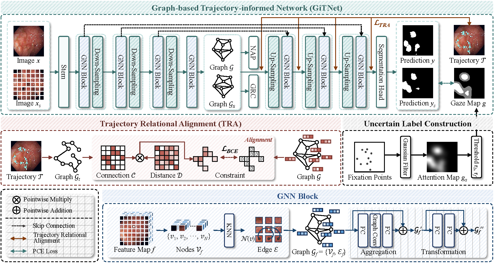
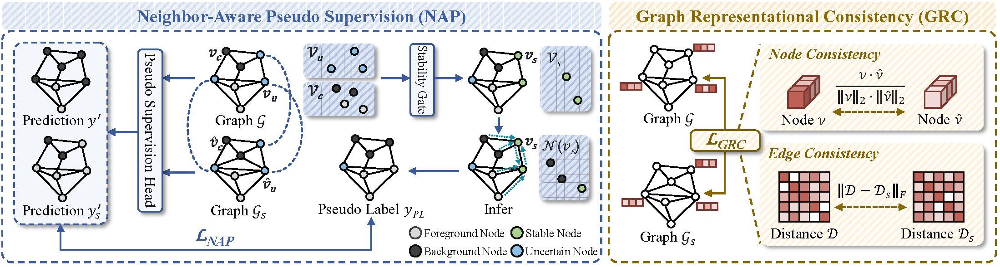
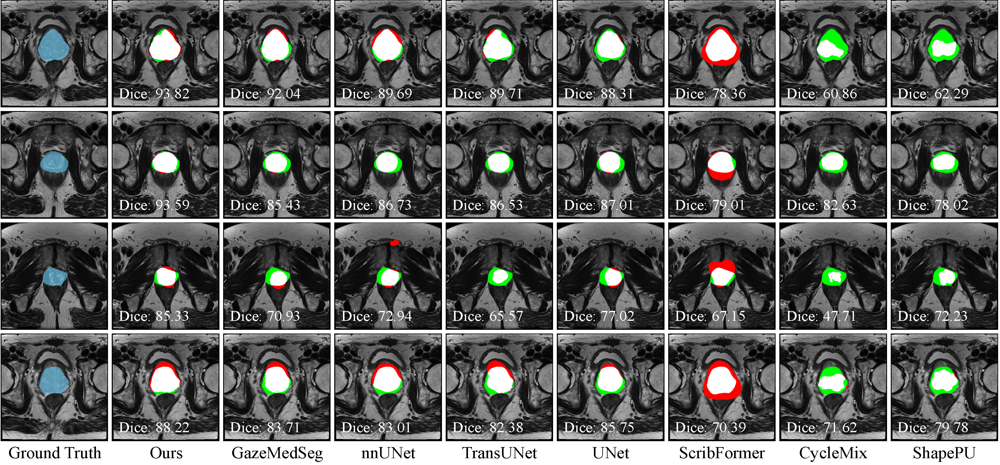

# GiTNet: A Graph-based Trajectory-informed Network for Gaze-Supervised Medical Image Segmentation

This project contains the training and testing code for the paper, as well as the model weights trained according to our method.

> Creating fully annotated labels for medical image segmentation is both time-consuming and costly, underscoring the need for efficient annotation schemes to alleviate the workload. Eye tracking offers an economical solution that can be seamlessly integrated into the clinicians' workflow, providing relevant supervision for tasks.
However, inaccuracies and ambiguity in gaze provide erroneous supervision for segmentation and impede the accurate decoding and modeling of expert knowledge within complex behavioral patterns. 
This hinders the model from comprehending intricate anatomical relationships, ultimately compromising the identification of organ and lesion boundaries in ambiguous regions.
To address these challenges, we propose the graph-based trajectory-informed network (GiTNet), which integrates static fixations with dynamic trajectories to comprehensively model complex anatomical relationships and potential lesion areas and aligns the visual search behavior of clinicians with the graph structure through the trajectory relational alignment (TRA).
Additionally, we introduce neighbor-aware pseudo supervision (NAP), which incorporates the semantic information from neighboring nodes in the graph to reduce noise and uncertainty in gaze.
Moreover, graph representational consistency (GRC) enhances the model’s ability to learn complex spatial structures and enhances supervision by applying perturbations and the consistency of nodes and edges.
Experimental results demonstrate that the GiTNet outperforms existing state-of-the-art weakly supervised methods and enhances clinical interpretability across two public datasets.


> Illustration of GiTNet, showing GNN blocks and sampling layers for graph construction and message passing, supervised by static gaze map and
dynamic trajectories aligned via the trajectory relational alignment module.


> The neighbor-aware pseudo supervision module utilizes information from neighboring nodes in the graph structure of uncertain nodes to infer
pseudo-labels for enhanced supervision. Graph representational consistency improves the model’s performance in understanding complex spatial relationships by strengthening the consistency constraint between the original and disturbed graphs.

## Qualitative Results



## Model Weights
The download links for our model weights are as [Weights](https://pan.baidu.com/s/12OJRLBM6HMV_kLL14hbmfw?pwd=jpzv).

## Datasets
The gaze of GazeMedSeg dataset can be downloaded at [Gaze](https://drive.google.com/drive/folders/1-38bG_81OsGVCb_trI00GSqfB_shCUQG).\
The GazeMedSeg dataset can download at [GazeMedSeg](https://drive.google.com/drive/folders/1XjgQ27R8zT8ymOTXohgl8HXntPEUbIXj).

The Kvasir dataset can download at [Kvasir](https://datasets.simula.no/kvasir-seg/).\
The NCI-ISBI dataset can download at [NCI](https://www.cancerimagingarchive.net/analysis-result/isbi-mr-prostate-2013/).

## Requirements
```
python == 3.8
torch == 1.12.0
numpy == 1.24.4
medpy == 0.5.1
nibabel == 5.2.1
pandas == 2.0.3
scikit-image == 0.21.0
```
